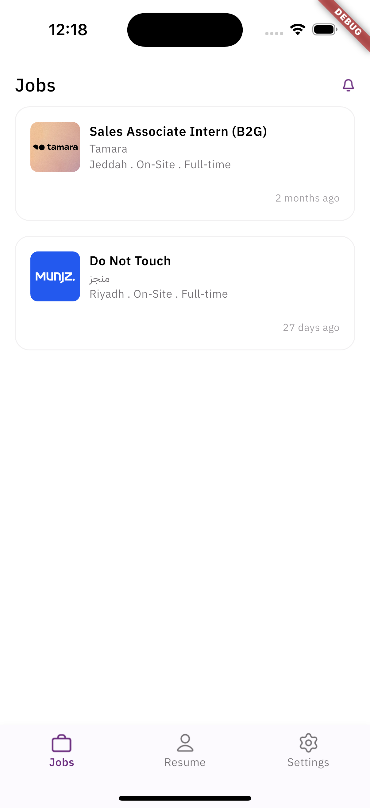
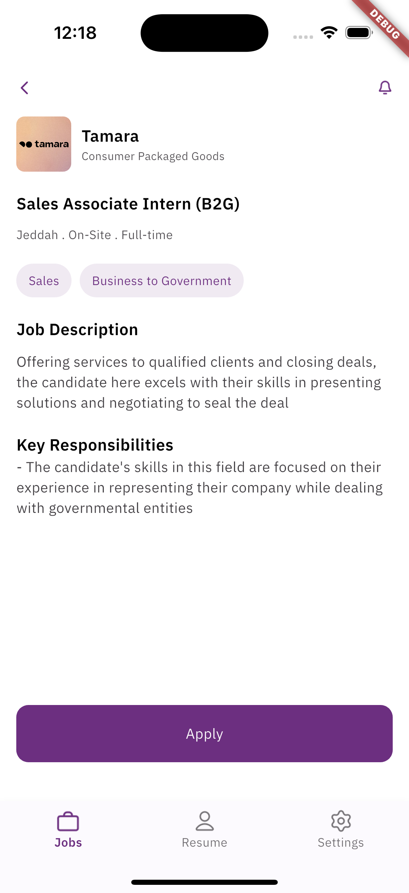

# Scaler

Scaler is a Flutter application. The app is architected following **Clean Architecture** principles, ensuring a maintainable, scalable, and testable codebase.

## 📱 Features

- **Job Listings:** Browse a comprehensive list of available job positions.
- **Job Details:** View detailed information about each job, including roles, responsibilities, and requirements.
- **Responsive UI:** Seamlessly adapts to various screen sizes and orientations.
- **Efficient Navigation:** Intuitive navigation with a customized Bottom Navigation Bar.

## 🖼️ Screenshots

### Job Listings


### Job Details



## 🏗️ Architecture

Scaler follows the **Clean Architecture** paradigm, which divides the project into distinct layers to promote separation of concerns and enhance scalability.

### Layer Breakdown

1. **Presentation Layer**
   - **Widgets & UI Components:** Responsible for rendering the user interface.
   - **State Management:** Utilizes Provider for managing app state.

2. **Domain Layer**
   - **Entities:** Core business objects of the application.
   - **Use Cases:** Encapsulate the business logic and rules.

3. **Data Layer**
   - **Repositories:** Abstract data sources and provide data to the domain layer.
   - **Data Sources:** Handle data retrieval from APIs, databases, or other sources.

*This separation ensures that each layer has a clear responsibility, making the app easier to maintain and extend.*

## 🚀 Getting Started

To run the Scaler app locally, follow these steps:

1. **Clone the Repository**
   ```bash
   git clone https://github.com/yourusername/scaler.git
   cd scaler
   ```

2. **Install Dependencies**
   ```bash
   flutter pub get
   ```

3. **Run the App**
   ```bash
   flutter run
   ```

*Ensure you have Flutter installed and set up on your machine. For more details, visit the [Flutter documentation](https://flutter.dev/docs/get-started/install).*

## 🛠️ Technologies Used

- **Flutter:** UI toolkit for building natively compiled applications.
- **Provider:** State management solution.
- **Freezed:** Code generation for unions/pattern-matching/copy.
- **JSON Serializable:** Automatic JSON serialization/deserialization.
- **Google Fonts:** Custom fonts for enhanced typography.


---
